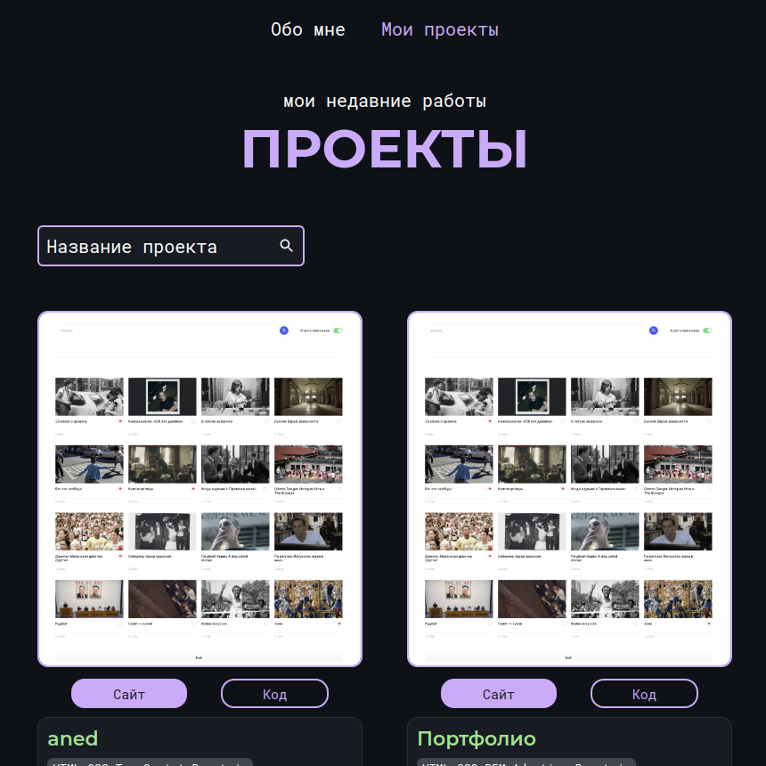

  <h1>portfolio v2</h1>

  

   

  
  
  
  
  

 
 

# Пpоекты

# [Проекты с длительной поддержкой находятся в категории "Пет-проекты"](#пет-проекты)

## Шифровальная машина
> Стэк: React MobX SCSS

Шифровальная машина - это онлайн сервис шифрования текстовых сообщений. Разработан выпускниками Яндекс.Практикума

\> [Ссылка на GitHub](https://github.com/encryption-machine/Front) 

\> [Ссылка на сайт](http://shifmachine.acceleratorpracticum.ru)

 

## TechnoCats Team blog
> Стэк: React Astro.js(SSR) CSS HTML FireBase

Командная работа из 6 человек над созданием сайта блога написанного на Astro 

\> [Ссылка на GitHub](https://github.com/teplostanski/technocats-team-blog) 

\> [Ссылка на сайт](https://technocats-team.teplostanski.dev/), [Зеркало](https://technocats-team.netlify.app/)

 

## Movies Explorer
> Стэк: HTML CSS React.js

Данное вeб-приложение является сайтом-портфолио и мини-кинопоиском, открывающимся после регистрации.

\> [Ссылка на GitHub](https://github.com/teplostanski/movies-explorer-frontend)

 

## Место
> Стэк: HTML CSS React.js

"Mesto" — это сайт, где люди обмениваются фотографиями. "Местом" может быть что угодно: город, область или какое-то заведение.

\> [Ссылка на GitHub](https://github.com/teplostanski/react-mesto-auth) 

\> [Ссылка на сайт](https://teplostanski.github.io/react-mesto-auth/)

 

## Путешествие по России
> Стэк: HTML CSS BEM 

Адаптивная веб-страница "Путешествия по России", описывающая необыкновенные места России.

\> [Ссылка на GitHub](https://github.com/teplostanski/travel) 

\> [Ссылка на сайт](https://teplostanski.github.io/travel/)

## Научиться учиться
> Стэк: HTML CSS BEM

Это одноcтраничный сайт о современных и эффективных подходов к обучению.

\> [Ссылка на GitHub](https://github.com/teplostanski/how-to-learn) 

\> [Ссылка на сайт](https://teplostanski.github.io/how-to-learn/)

# Пет-проекты

## aned
> Стэк: HTML CSS TypeScript React.js

Пет-проект. Онлайн редактор markdown-заметок

\> [Ссылка на GitHub](https://github.com/teplostanski/aned) 

\> [Ссылка на сайт](https://aned.teplostanski.dev/)

 

## Портфолио
> Стэк: HTML CSS React.js

Данное вeб-приложение является сайтом-портфолио и мини-кинопоиском, открывающимся после регистрации.

\> [Ссылка на GitHub](https://github.com/teplostanski/portfolio) 

\> [Ссылка на сайт](https://teplostanski.dev/)
